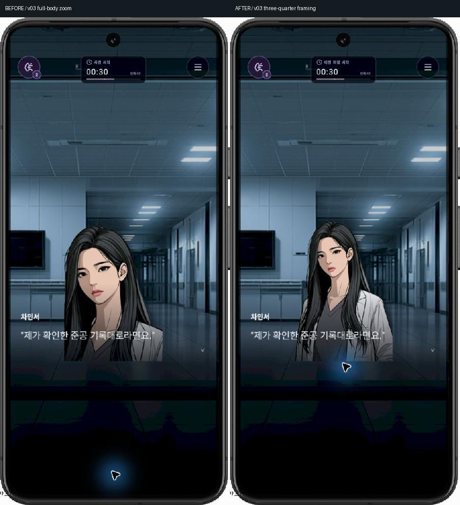
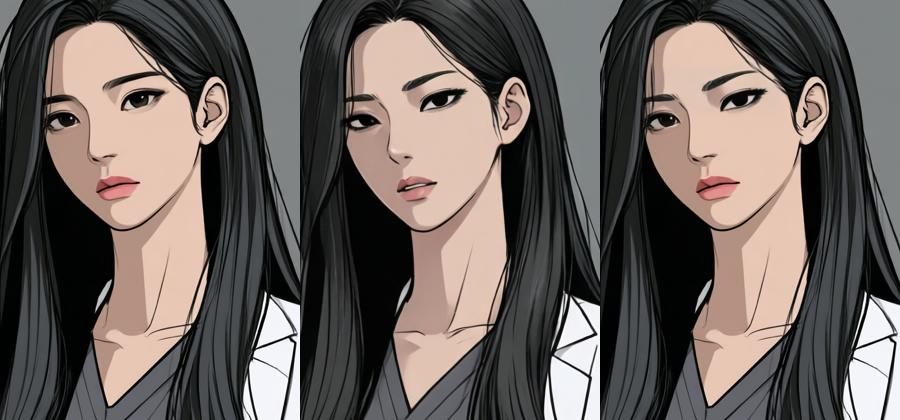

# 민서 v03 구도 통합과 Qwen 표정 연구

Clinical v03의 기본 얼굴은 유지했다. PNG 원본을 바꾸지 않았고, 이전 v02·v03·manifest·출처 기록을 보존했다. 기존 자산은 **Midjourney A RGB + ComfyUI BiRefNet 알파**, 머리부터 허벅지까지의 이미지다. Qwen이 이 원본을 만들었다거나 전신 완성본이라고 기록하지 않는다.

## 실제 장면 관찰 → 채택 → 통합

CH3 세 증언 장면을 정상 UI로 진행했다. 유진·태준·민서가 화자에 따라 교대하는 화면이며, 세 캐릭터가 동시에 보이는 삼인 화면을 검수한 것은 아니다. 민서 `SCENE_CH3_THREE_TESTIMONIES`, beat14의 “제가 확인한 준공 기록대로라면요.”에서 다른 인물에 비해 얼굴이 과도하게 크게 보였다. 원인은 허벅지까지의 자산에 전신용245% 확대를 적용한 프레이밍이다.

`NarrativePlayer.tsx`에서 v03을 `threeQuarter`로 분류하고 단독 세로 화면 확대를175%로 바꿨다. 기존 다인 장면의265%+개별0.66 배치는 유지한다. 원화에 픽셀 편집을 하지 않았다.

전후는 Loop2,offset187=00:30,beat14,standard,동일 기기/화면이다. `../EVIDENCE/art-state-comparison.json`에서 모든 기억·단서·소지품·플래그·경로와 대사 설정이 같음을 비교했다. 유일한 저장 차이는 F01 이전 시각을 명시하는 구버전 시계 메타데이터다. 이것은 **아트 상태 비교**이며 새 게임 시간 검증이 아니다. 실제 새 게임에서의 후속 재검은 배치 보고서에 별도 기재한다.

## 실제 ComfyUI 제작 — 미채택

현 서버 `127.0.0.1:8188/object_info`로 모델·노드·입력을 다시 확인했다. 기존 대기 작업이 없는 상태에서 작업1개를 제출했고 `3f531590-8a1c-47a8-9912-151ffe194a80`가66.4초 후 성공했다. API/작업/히스토리는 `../EVIDENCE/comfy-expression-*.json`에 있다. 신규 모델·노드 설치는 하지 않았다.

| 구분 | 실제 사용/확인 |
|---|---|
| 주력 생성 | `qwen_image_2512_fp8_e4m3fn.safetensors`, 일반 img2img |
| 인코더/VAE | `qwen_2.5_vl_7b_fp8_scaled.safetensors`, `qwen_image` / `qwen_image_vae.safetensors` |
| 샘플링 | AuraFlow3.1 → CFGNorm1.0, Euler/simple,20steps,CFG4,denoise0.25,seed2026091219 |
| 전용 Edit | `qwen_image_edit_fp8_e4m3fn.safetensors`와 TextEncodeQwenImageEdit 노드는 설치 확인만, 이번 실행에 사용하지 않음 |
| 알파 | v03 LoadImage 마스크를 JoinImageWithAlpha로 재사용. 이번 BiRefNet 재실행 없음 |
| 부분 합성 | Comfy 기본 SolidMask/FeatherMask/MaskComposite/ImageCompositeMasked. 눈썹 영역145×55,x310,y182 |

목적은 `SCENE_CH3_MINSEO_QUESTION`에서 임상적으로 질문하는 절제된 집중이다. `SCENE_CH3_MINSEO_DEATH`의 “민서만 바로 표정을 바꾸지 않았다”는 원문을 지키며 큰 감정 변화를 만들지 않았다. Midjourney 수동 대기 작업도 같은 기준·목적을 쓴다.

**미채택 판단:** 전체 연구안은 눈이 처지고 입술과 얼굴 음영이 바뀌었다. 눈썹 부분 합성은 입술·턱·복장을 보존하지만 오른쪽 눈매가 변하고 눈썹 상단 경계가 어색하다. 원본보다 정체성 보존이 낮으므로 둘 다 게임에 넣지 않았다. 미채택 후보는 `minseo-qwen2512-raw.png`, `minseo-focused-brow-candidate.png`로 보존한다.

픽셀 검증: 합성본 RGB 변경7,901픽셀, 마스크 밖 RGB 변경0, 가운/하체·입술 RGB 동일. 알파는5,099픽셀에서 최대1/255 차이(Comfy float 왕복)가 있어 **완전 동일이라고 주장하지 않는다**. 기존 불투명 픽셀이 투명해진 경우0. RGB를 바꾼 표정 연구이므로 ‘알파만 수정’ 작업으로 분류하지 않는다. 머리카락·귀·손·가운 내부를 시각 비교했고 원본에 안경이나 새 소품은 없다. 실제 채택한 PNG는 수정하지 않아 알파도 원본 그대로다.

## Midjourney

추가 실플레이: 새 게임 CH2 민서·유진 동시 화면과 CH3 세 증언 beat14, 민서 질문의 선택 화면을 확인했다. 단독 프레이밍 수정이 같은 상태의 기존 아트 비교에만 머무르지 않음을 확인했다. 최종 원화 PNG는 동일하다.

ComfyUI 재사용 워크플로는 `C:/AI/ComfyUI_windows_portable/ComfyUI/user/default/workflows/ZERO_HOUR_F01_MINSEO_FOCUSED_QWEN2512_20260912.json`으로 별도 저장했다. 실행은 기록된 API 작업이며 이 새 UI 워크플로를 브라우저에서 다시 실행했다고 계산하지 않는다.

신규 생성은 사용자 실행 대기다. 공식 허용 자동화 예외는 확인되지 않았다. `../MIDJOURNEY_JOBS.md`에 완성 프롬프트/참조/설정/필요 결과/저장 위치를 준비했다. 기존 MJ A 원본 활용, 실제 ComfyUI 제작, 구도 통합·Android 검수는 수행했다. 프롬프트 준비를 신규 이미지 생성 완료로 계산하지 않는다.
