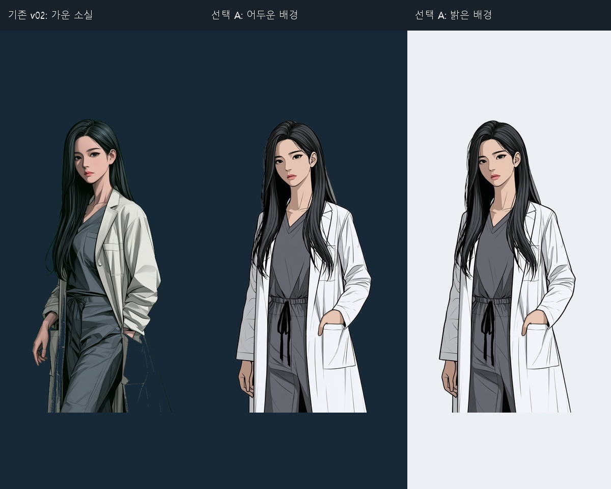
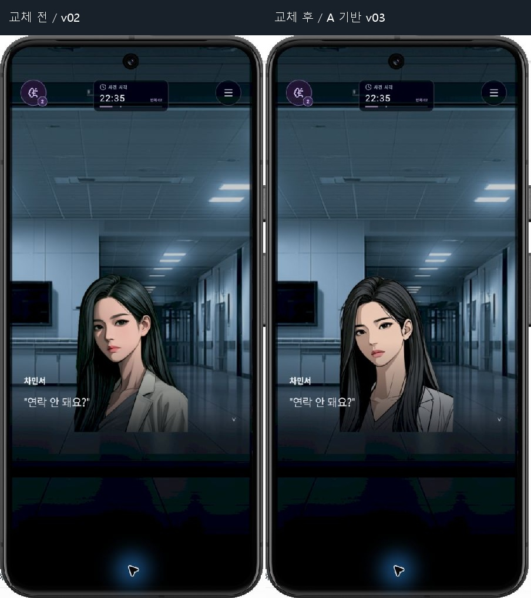
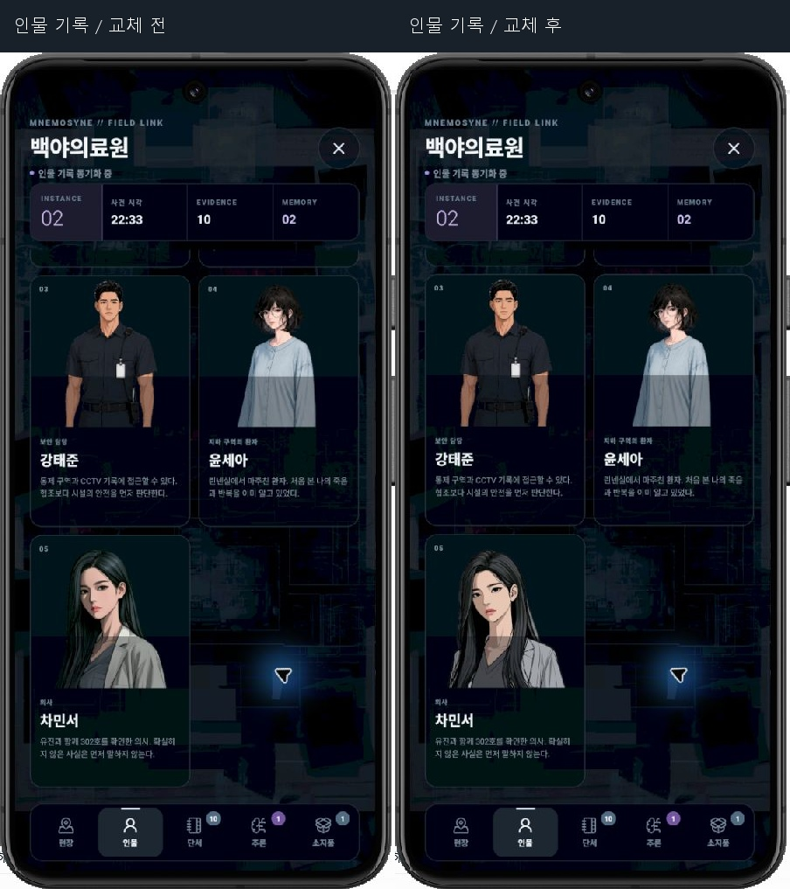
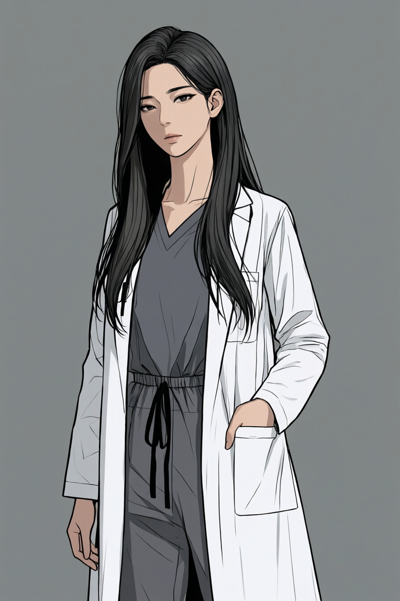

# 민서 Clinical v03 — 채택본과 Qwen 연구안

사용자의 변경 방향 수용과 자율 선택 위임에 따라 작업자가 이전 Midjourney 후보 A를 채택했다. 개별 후보 A에 대한 사용자 지정으로 해석하지 않았다. 이름·직무·관계·확정 대사는 그대로다. 얼굴의 시각적 변화는 아래 실제 캡처와 이전 A 비교판에 남긴다.

## 채택본

원화는 이전 배치 `minseo-mj-reference-A.png` (Midjourney job `1d2b6ec1-cc47-4457-b286-3a6ea265f2d4`, index0)다. 이번 실행에서 Midjourney 원화를 새로 생성했다고 주장하지 않는다. 최종 게임 파일은 `assets/characters/minseo/sprites/CHAR_Minseo_Clinical_ThreeQuarter_v03.png`다.

ComfyUI 기본 노드 `LoadBackgroundRemovalModel` → `RemoveBackground` → `InvertMask` → `JoinImageWithAlpha` → `SaveImage`로 제작했다. 해당 Join 노드의 마스크 의미에 맞춰 반전했다. API job `2401045a-ed2c-49bd-9704-8354e539ae91`, 1.79초 성공. [워크플로](../EVIDENCE/cutout-workflow.json), [API](../EVIDENCE/cutout-api.json), [실행 기록](../EVIDENCE/cutout-history.json).

RGB 픽셀은 A와 완전 동일하고 알파만 달라졌다. [수치 검사](../EVIDENCE/alpha-check.json). Python/Pillow는 수치 검사와 아래 비교판 제작에만 썼으며 게임용 픽셀 편집은 ComfyUI에서 수행했다.

## Qwen 2512 실제 제작 결과 — 미채택 연구안

다음 설치 파일과 노드를 `/object_info` 및 로컬 구성에서 확인하고 실행했다. SDXL 생성은 사용하지 않았다.

| 구성 | 실제 값 |
|---|---|
| UNETLoader | `qwen_image_2512_fp8_e4m3fn.safetensors` |
| CLIPLoader | `qwen_2.5_vl_7b_fp8_scaled.safetensors`, type `qwen_image` |
| VAELoader | `qwen_image_vae.safetensors` |
| ModelSamplingAuraFlow | shift3.1 |
| CFGNorm | strength1.0, pre_cfg false |
| KSampler | euler/simple,20steps,CFG4,denoise0.2,seed2026091201 |
| LoRA | `Qwen-Image-Lightning-4steps-V1.0.safetensors`, `qwen_image_union_diffsynth_lora.safetensors` 파일 확인만. 적용·호환성 검증하지 않음 |

API 첫 생성63.69초, Chrome Run 재생성66.91초, 출력 입력 경로 보정 뒤 최종 Chrome Run41.94초로 성공했다. 최종 job `611e4bb1-3fb6-456e-aac7-939bfd73e96f`. [실행 완료 캡처](../EVIDENCE/comfy-qwen-ui-completed.png), [실제 final prompt](../EVIDENCE/qwen-ui-final-prompt.json), [실행 이력](../EVIDENCE/qwen-ui-final-history.json).

시각 판단: 원화에 비해 눈꺼풀이 내려가고 입술 폭과 인상이 변했다. 사용자가 좋아한 A의 얼굴과 선화를 보존하는 편이 이번 목표에 더 적합하다고 판단해 Qwen 연구안을 통합하지 않았다. 생성 성공을 에셋 승인과 동일하게 취급하지 않는다. 이후 배경·새 에셋 생성의 기본 모델은 Qwen 2512로 두고 얼굴 파생은 같은 기준과 직접 비교한다.

## 로컬 재사용 위치

- `C:/AI/ComfyUI_windows_portable/ComfyUI/user/default/workflows/ZERO_HOUR_MINSEO_QWEN_2512_20260912.json` — Chrome에서 최종 Run 성공 후 저장. [보존 사본](../EVIDENCE/qwen-reusable-workflow-final.json).
- `C:/AI/ComfyUI_windows_portable/ComfyUI/user/default/workflows/ZERO_HOUR_MINSEO_ALPHA_20260912.json` — 알파 생성의 API 검증 완료본. Chrome 재실행까지 검증한 것으로 계산하지 않는다.
- Qwen 최종 UI 입력은 output 루트의 `MINSEO_APPROVED_A_RGBA_20260912_00001_.png [output]`다. UI 선택기의 하위 폴더 누락에 맞춰 이번 출력만 루트에 byte-exact 복사했다. 원래 `output/ZERO_HOUR/` 파일도 남아 있다. LoadImage의 RGB 입력이 A와 같으므로 연구안의 원화 기준이 바뀌지 않는다.
- 원래 A 입력 복사본은 `input/ZERO_HOUR_Minseo_approved_direction_A_20260912.png`다. 알파 API 워크플로가 이 파일을 사용한다.
- 파일 업로드 확장 권한은 변경하지 않았다. 기존 SDXL 작업과 사용자 미저장 워크플로도 수정하지 않았다.

BiRefNet 공식 모델을 `models/background_removal/birefnet.safetensors`에 추가했다. 크기444,473,596바이트, SHA-256 `9ab37426bf4de0567af6b5d21b16151357149139362e6e8992021b8ce356a154`. [다운로드 로그](../EVIDENCE/birefnet-download.log). 설치 노드 추가 없이 공식 기본 노드를 사용했다. [Comfy 공식 배경 제거 설명](https://docs.comfy.org/tutorials/utility/remove-background-birefnet), [공식 배포 모델](https://huggingface.co/Comfy-Org/BiRefNet/blob/main/background_removal/birefnet.safetensors), [Qwen 2512 공식 구성](https://docs.comfy.org/tutorials/image/qwen/qwen-image-2512).
