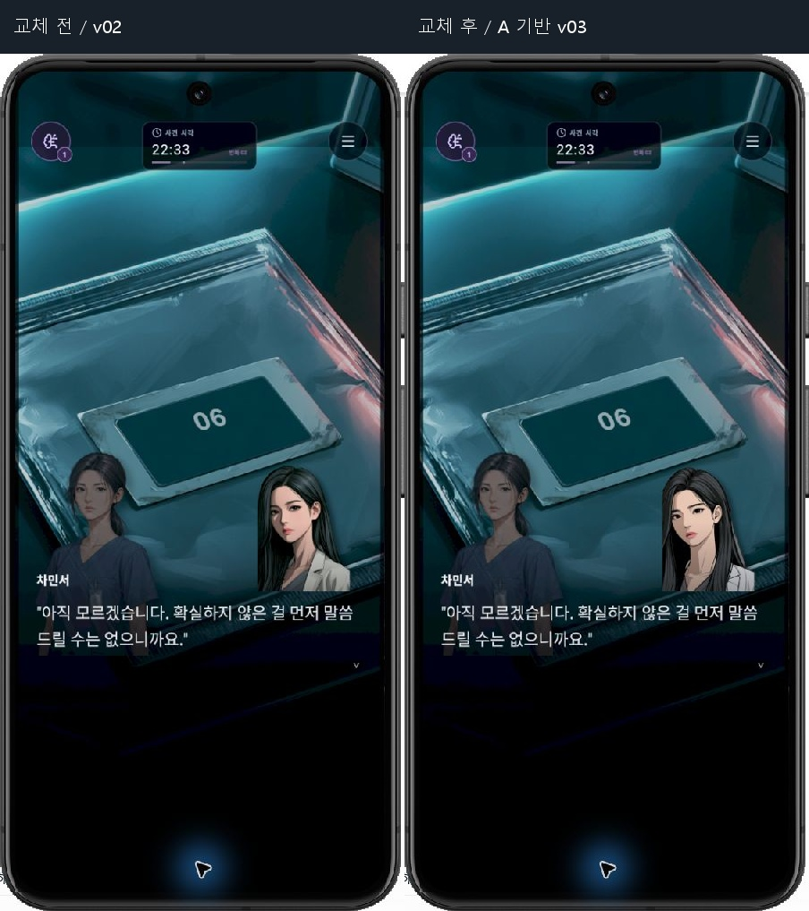

# ZERO HOUR — 민서 Clinical v03 적용 / Qwen 2512 제작 배치

2026-09-12 KST. 프로젝트 `C:/Dev/zero-hour-game`, branch `master`, HEAD `2f6e21a8eac8829bf216fdc177abb5b8b512304d`. 이전 F04 미커밋 수정 위에서 진행했다. 커밋·스테이징·브랜치 변경 없이 로컬 제작 결과를 남긴다.

## 완료한 결과

민서 Clinical v03을 대사 화면과 인물 기록에 적용했다. 사용자는 바뀐 민서 방향에 호감을 밝혔고 별도 승인 없이 최선을 선택하도록 위임했다. 작업자가 이전 후보 A를 선택했으며 사용자가 A를 개별 지정했다고 기록하지 않는다.

최종 이미지는 **Midjourney 후보 A의 RGB를 그대로 보존하고 로컬 ComfyUI BiRefNet으로 알파만 생성**했다. Qwen Image 2512 보정도 실제로 생성·비교했으나 눈매와 입술이 달라져 연구안으로 남겼다. 이 배치에서 SDXL 생성은 실행하지 않았다. 기존 SDXL 탭과 저장 워크플로는 보존했다.

## 현재 기준과 이전 작업 보존

- 시작 시 이전 배치의 코드 229개와 증거 164개 해시가 모두 일치했다. [시작 재검증](EVIDENCE/baseline-revalidation.json), [기존 미커밋 diff](EVIDENCE/baseline-code.patch).
- 종료 시 이전 코드 229개 중 이번에 의도한 `ASSET_MANIFEST.json`, `NarrativePlayer.tsx`, `FieldKit.tsx`만 달라졌다. 나머지 226개는 동일하다. 기존 F04 동작·테스트를 보존했다.
- 이전 배치 증거 164개, PHASE 0 증거 101개, 기존 ComfyUI 저장 워크플로 3개가 모두 동일하다. [최종 보존 검사](EVIDENCE/preservation-final.json).
- staged는 비어 있다. [전체 로컬 상태](EVIDENCE/git-final-status.txt), [untracked 전체 목록](EVIDENCE/git-final-untracked.txt), [누적 diff — 이전 F04 포함](EVIDENCE/cumulative-code.patch), [현재 코드 해시 231개](EVIDENCE/code-sha256-final.csv).
- 시나리오 원문, 게임 규칙, 다른 캐릭터 원화, 사운드, 게임 의존성·설정을 바꾸지 않았다. PROJECT SALVAGE 및 다른 프로젝트를 조사하거나 수정하지 않았다.

## 이번 변경 파일

| 파일 | 변경 이유 / 범위 |
|---|---|
| `assets/characters/minseo/sprites/CHAR_Minseo_Clinical_ThreeQuarter_v03.png` | 새 896×1344 RGBA. 머리부터 허벅지까지이며 전신 완성본으로 부르지 않는다. SHA-256 `0cfdcb8098ffb45151a6287409e68d61948d3b180a05837bed49f65f5f6f0b77` |
| `src/ui/NarrativePlayer.tsx:178` | `minseoClinical` require 한 줄 교체. 기존 F04 수정 유지 |
| `src/ui/FieldKit.tsx:46` | 인물 기록의 민서 require 한 줄 교체 |
| `assets/ASSET_MANIFEST.json` | 통합 경로·갱신일·실제 출처와 결정 근거 갱신 |
| `assets/characters/minseo/IDENTITY_LOCK_2026-09-12.md` | Clinical 단일 표정 기준, 위임된 선택, 유지 특징, Qwen 기본 제작 규칙 기록 |
| `docs/qa/README.md`, 이 배치 폴더 | 최신 포인터, 보고서, 전후 캡처, 세이브·로그·비교·워크플로 증거 |

이전 v02 파일은 그대로 남아 있다. 외부 로컬 ComfyUI에는 이 배치의 입력·출력·새 워크플로 2개와 공식 BiRefNet 모델 444,473,596바이트를 추가했다. 게임 패키지나 ComfyUI 커스텀 노드를 추가하지 않았다.

## 관찰·판단·미적용안을 구분한 결과

| 구분 / 문제 | 파일·장면 / 재현 조건 | 증거와 최소 조치 | 영향 / 승인 상태 |
|---|---|---|---|
| F07 실제 관찰: 민서 v02의 광택·음영이 주변 선화와 이질적 | v02, `SCENE_LOOP2_06_CARD` beat9, `SCENE_LOOP2_SEOYUN_UNCERTAIN` beat27 | 동일 상태 전후에서 A 기반 v03으로 교체 확인. 얼굴과 눈매 변화는 숨기지 않고 비교판에 표시 | Clinical을 참조하는 모든 장면·인물 기록. 사용자의 방향 수용과 자율 선택 위임 범위에서 적용 |
| 실제 관찰: 기존 가운 내부 알파 소실 | v02 원본을 밝고 어두운 배경에 합성 | [알파 비교](ART_REVIEW/alpha-comparison.jpg). 새 가운 ROI 최소 알파254, 배경 모서리0. RGB 최대 차이0 | 원화의 흰 가운을 보존한 알파 재생성 완료. 런타임은 상체 중심 구도여서 가운 전체의 GUI 노출 검증으로 확대하지 않음 |
| 시각 판단: Qwen 보정안의 눈·입 형태 변화 | denoise0.2, CFG4, 20 steps, seed2026091201 | [원화와 연구안 판단](ART_REVIEW/REVIEW.md). 선화 개선만으로 정체성 변경을 수용하지 않고 연구안 미통합 | 이후 표정 파생은 새 Clinical 기준과 다시 비교. 이번 추가 승인 안건 없음 |
| 실제 관찰: Comfy 이미지 선택기에서 출력 하위 폴더 경로 누락 | `[output]` 파일을 선택하고 실행 | 선택기가 요구한 output 루트에 이번 RGBA를 바이트 그대로 복사한 뒤 같은 Run 성공. [경로 보정 해시](EVIDENCE/comfy-ui-input-path-fix.txt), [완료 캡처](EVIDENCE/comfy-qwen-ui-completed.png) | 이번 작업 파일만 추가. 기존 워크플로·환경 설정 변경 없음 |
| 기존 F01 재관찰: 자정 기억과 실제 시계 불일치 | 정상 Loop2 공개 경로 → 직원용 문 → 알려진 정전 대기. GUI 21:53→21:58 | `009`~`013` 캡처. 확정 21:23·약50분·00:00 및 CH3 00:27/01:06을 함께 만족하는 시간 계약 수정이 필요 | 시간·기억 사용 구간·선택 도달성 전반. 이번 배치에서는 미수정. [다음 배치](NEXT_BATCH.md) |

화풍이 전체 캐릭터·표정·CG에서 완전히 통일됐다는 판정은 하지 않는다. 이번 관찰에서는 민서의 무광 선화 방향과 두 런타임 참조의 일치가 개선됐다고 판단했다. 확정 대사, 06 단서, 인물의 정보 상태와 감정 전개는 보존했다.

## 자동 검증과 실제 GUI 검증

`npm test` 전체 **PASS, exit0**. [로그](EVIDENCE/npm-test-after.log), [종료 코드](EVIDENCE/npm-test-after-exit.txt). CH3 원문93줄 및198 자동 경로, F04 기억·공개 결과, 입력·조사·추론·저장 등 기존 검사가 통과했다. `git diff --check`도 exit0. 자동 경로 수는 실제 GUI 플레이 수가 아니다.

Computer Use를 실제 호출해 격리 Android 에뮬레이터의 화면을 읽고 일반 터치·스크롤로 진행했다. API35, 1080×2400, density420, font_scale1, `emulator-5580`. debug APK SHA-256 `72bed25b0643ea56a1cec54ff93f0fce9ce0e5d1fa935577f748aa8a15405f6c`, 패키지 `com.jungih4982.zerohourgame`. 기존 네이티브 debug APK에 현재 로컬 Metro JS를 공급한 개발 빌드 검증이며 새 배포 APK를 만든 것은 아니다. 전후 번들 해시는 별도 보존했다.

이전 정상 UI 저장을 해시로 확인하고 격리 기기에만 복원했다. 시작 F04 장면을 포함한13장면, 새 도달12장면을 실제 입력으로 진행했다. 수정 후에는 같은 CCTV 진입 저장으로 돌아가 CCTV→06 카드→서윤 불확실의3장면과 인물 기록을 같은 경로로 재검증했다. [GUI 입력 기록과 범위](EVIDENCE/GUI_PLAY_LOG.md), [장면 목록](EVIDENCE/gui-scene-scope.json), [입력·캡처 로그](EVIDENCE/computer-use-inputs.ndjson).

| 동일 상태 비교 | 변경 전 / 변경 후 | 결과 |
|---|---|---|
| `SCENE_LOOP2_06_CARD`, Loop2 22:33, beat9 | `035-before-minseo-speaking.png` / `049-after-minseo-speaking.png` | 민서 교체 표시. 전체 논리 저장·환경설정 값 동일 |
| 위 장면에서 현장 기록 → 인물 → 스크롤 | `before-people-list-minseo.png` / `after-people-list-minseo.png` | 민서 인물 카드 교체 표시, 닫은 뒤 같은 대사로 복귀 |
| `SCENE_LOOP2_SEOYUN_UNCERTAIN`, Loop2 22:35, beat27 | `044-before-minseo-solo.png` / `058-after-minseo-solo.png` | 민서 단독 대사 표시. 전체 논리 저장·환경설정 값 동일 |

입력 저장 복원은 바이트 동일성을 확인했다. 플레이 후 SQLite 컨테이너 해시 자체는 다르지만 파싱한 모든 게임 상태와 환경설정은 전후 일치한다. [비교 결과](EVIDENCE/before-after-state-comparison.json). 대사 끝 선택지까지 정상 입력으로 도달하고 최종 저장을 남겼다.

앱 대상 로그에서 검사한 FATAL/ReactNativeJS 오류 패턴은 없었다. 그러나 새 AVD 시작 과정의 Android/GMS/SystemUI 크래시가 crash buffer에 있다. 앱 패키지가 해당 crash buffer에 등장하지 않는다는 범위로만 기록하며 전체 환경 안정성 통과로 표시하지 않는다. [로그 요약](EVIDENCE/android-log-summary.json), [앱 로그](EVIDENCE/android-after-app.log), [시스템 crash buffer](EVIDENCE/android-after-crash.log).

## 미검증·남은 문제

- CH3에서 v03이 들어가는 다른 구도·다인 장면, 민서 다른 표정·후면·신발 포함 전신·CG 간 일관성은 미검증이다. F07 전체 완료가 아닌 Clinical 단일 통합 완료다.
- 수정 후 첫 밤·첫 리셋 전체 GUI, iOS·실기기·태블릿·큰 글꼴·릴리스 빌드·오디오·장시간 성능은 미검증이다.
- 대사 넘김을 빠르게 반복한 기능 QA였으므로 자연 독서 속도의 몰입도나30–45분 체험 완성 판정이 아니다.
- B1 카트는 터치 시도했지만 해당 단서 획득을 확인하지 못했다. 정식 결함으로 확정하지 않고 다음 GUI 재검 지점으로 남긴다. 인물 카드는 탭해도 별도 상세 화면으로 열리지 않았으며 목록 확인으로만 계산한다.
- F01 시간 계약, CH2 대사 축약·손목밴드 재획득·용어 공개 시점·ORIGIN TRACE 선택 의미는 기존 감사의 미해결 상태를 유지한다. 새 창작 편집안은 적용하지 않았다.

## 재개와 정리

최종 위치는 `SCENE_LOOP2_SEOYUN_UNCERTAIN`, Loop2, offset72=22:35, beat32, 두 선택지 표시 상태다. [정확한 저장과 다음 작업](NEXT_BATCH.md). 테스트용 Metro와 격리 에뮬레이터만 결과 수집 뒤 종료하며 기존 ComfyUI 서버와 사용자 Chrome 탭은 유지한다. 실제 종료 확인은 [환경 정리 로그](EVIDENCE/session-cleanup.json)에 기록한다.

초기 Android 설치/포트 설정을 묶은 명령 두 건은 자동 승인 검토가 `blocked by policy`로 거절했으며 상세 사유는 제공되지 않았다. 설치는 별도 정상 명령으로 완료했고 앱은 에뮬레이터 UI에서 실행했다. 포트 reverse는 다시 시도하지 않았고 정상 개발 클라이언트의 호스트 연결로 검증했다. Chrome 파일 업로드는 확장 프로그램의 file URL 권한 제한으로 실패해 설정을 바꾸지 않았다. 로컬 작업 입력과 출력 경로를 준비해 ComfyUI UI 실행을 완료했다.
